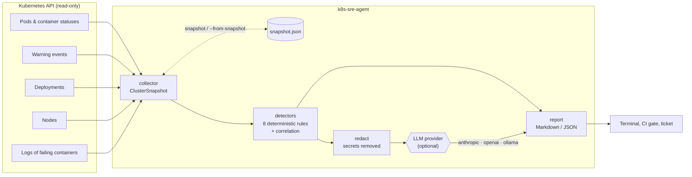

# k8s-sre-agent

**Point it at a broken Kubernetes namespace and get a root cause analysis in seconds: read-only, deterministic detectors first, optional LLM reasoning on top.**

[](https://github.com/Sudo-oy/k8s-sre-agent/actions/workflows/ci.yml)
[](LICENSE)
[](pyproject.toml)
[](deploy/rbac.yaml)
[](https://github.com/astral-sh/ruff)

```text
$ k8s-sre-agent diagnose -n sre-demo
# Diagnosis for namespace `sre-demo`
**6 finding(s)**: 5 critical, 1 warning

## 2. [CRITICAL] Deployment/checkout: Container 'app' is in CrashLoopBackOff
- **Probable cause**: Exit code 1: the application exited with a generic error; ...
- log: FATAL: environment variable PAYMENT_API_URL is not set
- rollout: Deployment has 0/1 available replicas
...
```

## Why

During an incident, the first ten minutes go to the same `kubectl get / describe / logs / events` routine. `k8s-sre-agent` automates that routine:

1. It **collects** a read-only snapshot of a namespace (pods, container states, warning events, deployments, nodes and the logs of failing containers).
2. It **detects** known failure modes with deterministic, unit-tested rules and correlates symptoms with their cause.
3. Optionally, it **asks an LLM** (Anthropic Claude, any OpenAI-compatible endpoint, or a local Ollama model) to write a root cause analysis grounded in that evidence, after redacting secrets.

The tool never changes the cluster. It only suggests commands.

## Features

- **8 detectors**: `CrashLoopBackOff` (with exit-code interpretation and log excerpts), `OOMKilled`, image pull failures (missing tag, auth, network, rate limit), missing ConfigMap/Secret, unschedulable pods (resources, taints, affinity, PVC), failing liveness/readiness/startup probes, stalled rollouts and unhealthy nodes.
- **Symptom/cause correlation**: a Deployment with no available replicas is attached to the pod-level cause instead of being reported twice. Replicas of the same workload are grouped into one finding.
- **Provider-agnostic LLM layer**, configured only through environment variables: `anthropic`, `openai` (OpenAI-compatible: OpenAI, vLLM, LiteLLM...), `ollama`, or `none`.
- **Privacy by default**: no LLM unless you opt in, secrets redacted from prompts and reports, `--no-logs` to never read container logs.
- **Offline and CI-friendly**: `snapshot` saves the cluster state to JSON, `diagnose --from-snapshot` replays it, `-o json` and `--fail-on` turn it into a pipeline gate.
- **Least privilege**: only `get`/`list` on pods, events, nodes and deployments, plus `pods/log` ([`deploy/rbac.yaml`](deploy/rbac.yaml)).

## Architecture



## Quick start

With a working `kubectl` context:

```bash
pip install "k8s-sre-agent[anthropic]"
export SRE_AGENT_LLM_PROVIDER=anthropic ANTHROPIC_API_KEY=...   # optional, skip for rules only
k8s-sre-agent diagnose -n my-namespace
```

### Reproducible demo (kind)

The demo creates a local [kind](https://kind.sigs.k8s.io/) cluster, deploys six broken workloads (crash loop, OOM, bad image tag, missing ConfigMap, impossible memory request, failing readiness probe), waits until each failure is detected and prints the report. Expected result: [`demo/expected-output.md`](demo/expected-output.md).

```bash
git clone https://github.com/Sudo-oy/k8s-sre-agent.git && cd k8s-sre-agent
pip install -e .
./demo/run-demo.sh            # ./demo/run-demo.sh --cleanup deletes the cluster
```

The same scenario runs on every pull request in the `e2e` CI job.

## Usage

```text
k8s-sre-agent diagnose [-n NAMESPACE] [-l SELECTOR] [--context CTX] [--no-logs]
                       [--from-snapshot FILE] [-o markdown|json]
                       [--llm none|anthropic|openai|ollama] [--fail-on never|warning|critical]
k8s-sre-agent snapshot [-n NAMESPACE] [-l SELECTOR] [--context CTX] [--no-logs] -f FILE
k8s-sre-agent version
```

| Exit code | Meaning |
|---|---|
| `0` | Success (and no finding above `--fail-on`) |
| `1` | Error: cluster unreachable, invalid snapshot or misconfigured provider |
| `2` | At least one finding at or above the `--fail-on` severity |

Examples:

```bash
# Rules only, JSON output, fail a pipeline on critical problems
k8s-sre-agent diagnose -n payments -o json --fail-on critical

# Capture now, analyse later (or attach to an incident ticket)
k8s-sre-agent snapshot -n payments -f incident-42.json
SRE_AGENT_LLM_PROVIDER=ollama k8s-sre-agent diagnose --from-snapshot incident-42.json
```

## Configuration

All LLM settings come from environment variables; nothing is read from files and no key is ever hard-coded. See [`.env.example`](.env.example).

| Variable | Description | Default |
|---|---|---|
| `SRE_AGENT_LLM_PROVIDER` | `none`, `anthropic`, `openai` or `ollama` | `none` |
| `SRE_AGENT_LLM_MODEL` | Model name (required for `openai`) | `claude-opus-5` (anthropic), `llama3.1` (ollama) |
| `SRE_AGENT_LLM_TIMEOUT` | Request timeout in seconds | `120` |
| `ANTHROPIC_API_KEY` | Anthropic credentials (also `ANTHROPIC_AUTH_TOKEN` or an `ant auth login` profile) | — |
| `OPENAI_API_KEY` | Key for the OpenAI-compatible endpoint | — |
| `OPENAI_BASE_URL` | Base URL of the OpenAI-compatible endpoint | `https://api.openai.com/v1` |
| `OLLAMA_HOST` | Ollama server URL | `http://localhost:11434` |

Kubernetes access uses the in-cluster service account when available, otherwise your kubeconfig (`--context` to pick one).

**Data sent to an LLM provider**: the findings, a summary of unhealthy pods, warning events, deployment replica counts and the last log lines of failing containers, after secret redaction. Use `ollama` to keep everything on your infrastructure, or `--no-logs` to exclude logs.

## Development

```bash
pip install -e ".[dev]"
ruff format --check . && ruff check .
mypy
pytest --cov=k8s_sre_agent
python -m build && twine check dist/*
```

## Roadmap

- [ ] Detectors for StatefulSets, Jobs/CronJobs, HPA saturation, PVC and Ingress/Service endpoint issues
- [ ] Watch mode and Kubernetes `CronJob` manifest that posts reports to Slack or a GitHub issue
- [ ] Container image and Helm chart
- [ ] Prometheus metrics correlation (error rate, latency, saturation) in the snapshot
- [ ] MCP server mode so coding agents can call the diagnosis as a tool
- [ ] Multi-namespace and cluster-wide scans
- [ ] Publish to PyPI with trusted publishing

## Contributing

Contributions are welcome, especially new detectors with a fixture-based test. Read [CONTRIBUTING.md](CONTRIBUTING.md) and the [Code of Conduct](CODE_OF_CONDUCT.md). Report vulnerabilities privately as described in [SECURITY.md](SECURITY.md).

## License

[Apache License 2.0](LICENSE)
